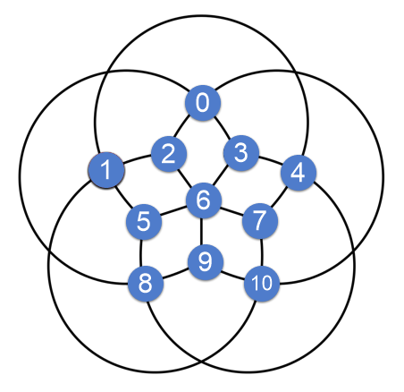

# Local search and optimization algorithms in AI
In this project, I implement some of the local search and optimization algorithms are used in AI, such as:
- Hill Climbing(simple)
- Stochastic Hill Climbing
- First Choice Hill Climbing
- Random Restart Hill Climbing
- Simulated Annealing
- Genetic Algorithm (GA)

## How to use
To use these algorithms for solving your problem, you should define your problem and its state classes that extend from Problem and State class.

Use `MyProblem extends Problem` and `MyProblemState extends State` to achieve that.

For example, I model a map(graph) coloring problem that each node should have a color different from its neighbors. In this problem, we have 3 colors, I take 0,1 and 2 as colorIDs. You can see the graph with their nodes' IDs below:

  
